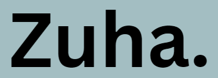

# Steps to make your own portfolio
These are the steps i followed.  

## Steps guidance

This website-making-process is divided into specific parts:
| No. | Part | Steps |
| --- | ---- | ----- |
| 1 | Starting the website and adding universal information (creating the files and adding basic css) | 6 | 
| 2 | HEADER: creating the header and welcome page (background, title, navigation buttons) | 14 | 
| 3 | ABOUT: the second part after scrolling from welcome is about. creating the about page. |

Total no. of parts: 

Total no. of steps: 

## Important Milestones

| No. | Date | Steps | Part |
| --- | ---- | ----- | ---- |
| 1 | Monday, July 29, 2024 | 01 - 07 | 1 & 2 |
| 2 | Wednesday, July 31, 2024 | 08 - 14 | 2 |
| 3 | Thursday, August 01, 2024 | 15 - 17 | 2 |
| 4 | Friday, August 02, 2024 | 18 - 25 | 2 & 3 |
| 5 | Sunday, August 04, 2024 | 26 | 3 | 
| 6 | Monday, August 05, 2024 | 27 -  | 3 |

## PART 1: Start the program 

 **Date** = Monday, July 29, 2024   

### STEP 1
 create an ```index.html``` file by creating a new file and naming it    

### STEP 2
 add basic HTML code inside your ```index.html``` file:    
```
<!DOCTYPE html>
<html lang="en">
<head>
    <meta charset="UTF-8">
    <meta http-equiv="X-UA-Compatible" content="IE=edge">
    <meta name="viewport" content="width=device-width, intial-scale=1.0">
    <title> Document1 </title>
</head>
<body>

</body>
</html>
```
in between the ```<html>``` and ```</html>``` tags, there are two parts, ```<head>``` and ```<body>```. the head part will contain infromation about your website, and the body part will contain the contents of your website

### STEP 3
 create a file called ```style.css``` and add the following code:
```
*{
    margin: 0;
    padding: 0;
    font-family: 'Poppins', sans-sherif;
    box-sizing: border-box;
}
```
this * means universal selector, it applies for all elements on the page

### STEP 4
 connect this file of ```style.css``` with our ```index.html``` by adding the code in between the ```<head>``` and ```</head>``` space:
```
<link rel="stylesheet" href="style.css">
```

### STEP 5
 change your title in ```index.html``` to whatever you prefer, inside the ```<title>``` tag
```
<title> Add your title </title>
```

### STEP 6
 add css for ```<body>```:
```
body{
    background: #080808; /* add a dark color as the background */
    color: #fff; /* add text color as white */
}
```
and run this in your browser. you should see a black screen as the background color is set to black.  

## PART 2: Header

### STEP 7
 add your background image for the front that will popup when you open the website. do this by creating a ```<div>``` in ```index.html``` called "header", and use css to beautify it    
code for ```index.html```:
```
#header (tab)
```
or type out:
```
<div id="header>

</div>
```
code for ```style.css```:
```
#header{
    /* use # infront of header as it is an ID */
    width: 100%;
    height:100vh;
    background-image:url(images/background.png); /* save your image into an images folder with the name of file as background.png */
    background-size: cover;
    background-position:center;
}
```
now re-load your website in your browser. you should see your background image covering the screen. 

 **Date** = Wednesday, July 31, 2024

### STEP 8
 add a navigation bar with a logo. first we will add a logo.   
 so for this, add a container in your HTML file inside the ```<header>``` id tag:
```
.container + TAB
```
or
```
<div class="container">

</div>
```
then add a ```<nav></nav>``` inside your ```<container>``` hashtag, and then add your logo image URL
```
<nav>
    
</nav>
```
a ```<nav>``` tag defines a block of navigation links

### STEP 9
 add navigation buttons
 add it in your ```index.html```, inside the ```<nav>``` hashtag
```
<ul>
    <li> <a href="#"> Home </a> </li>
    <li> <a href="#"> About </a> </li>
    <li> <a href="#"> Services </a> </li>
    <li> <a href="#"> Portfolio </a> </li>
    <li> <a href="#"> Contact </a> </li>
</ul>
```
this makes an unordered list (bullets, not numbers), where each element in the list is hyper-linked, since there is no link address we use #

### STEP 10
 add css to the ```<container>```
```
.container {
    /* add some padding to the text, so that it shifts to the right */
    padding: 10px 10%;
}
```
now reload and check, as the logo img is inside .container, it also shifts some space to the right

### STEP 11
now add CSS for the ```<nav>``` tag
```
nav {
    display:flex;
    /* flex means that image and links are side-by-side */
    allign-items: center;
    justify-content: space-between;
    flex-wrap: wrap;
} 
```
now reload your browser. you should see that the logo is on the left with padding and the navigation buttons are on the right, stacked on top of each other

### STEP 12
now make the logo smaller by adding its css
```
.logo{
    width: 140px;
}
```

### STEP 13
add CSS to the navigation buttons
```
nav ul li {
    display: inline-block;
    /* so now it is horizontally aligned */
    list-style: none;
    margin: 10px 20px;
    /* we add margin so that we have space between the things, 10px from top and bottom and 20px from left and right side */ 
}
```
now refresh in your browser, the navigation buttons are in one line with no bullet points

### STEP 14
now make the navigation buttons non-underlined and change the color
so same CSS name but add "a" for hyperlink reference
```
nav ul li a {
    color: #fff;
    /* makes the color of the text white */
    text-decoration:none;
    /* removes all text decorations such as underline */
    font-size: 10px;
}
```

 **Date** = Thursday, August 1, 2024

### STEP 15
now add a hover effect on these links using ```style.css```
```
nav ul li a::after{
    content:"";
    width:100%;
    height:3px;
    background: #ff004f;
    position:absolute;
    /* as position here is absolute, make position in "nav ul li a" as relative */
    left:0;
    bottom:-6px;
}
```
change the code in ```nav ul li a <position>``` to relative
```
nav ul li a{
    position: relative;
}
```
now when you refresh the browser, you will see a red colored link below all the links

### STEP 16
so now we want to hide these red lines and ONLY display them when the cursor hovers on them
update your ```style.css``` code:
```
nav ul li a::after{
    width: 0; 
    /* so now the line is hidden */
}
```
so now add this code
```
nav ul li a:hover::after {
    width: 100%;
}
```
now add a transition declaration in ```nav ul li a::after```
```
nav ul li a::after{
    transition: 0.5s; 
    /* this puts the transition in 0.5 s which will happen whenever cursor hovers on it */
}
```
so now when you reload your browser, the red line comes underneath the button ONLY if you hover on it, and it comes slowly from left to right and then when you remove it goes back right to left.
play around with the transition speed to see the difference

### STEP 17
add text and title to your welcome screen
go to your HTML file and add a div after the ```<nav>``` tag, inside the ```<div id=header>``` tag. 
```
<div class="header-text">
    <p> Your designation </p>
    <h1> Main title, your name</h1>
</div>
```
reload your browser, you should see the text you entered displayed in white

 **Date** = Friday, August 2, 2024

### STEP 18
now add some css to your name/designation/title, to make it at the correct place
```
.header-text{
    margin-top: 20%;
    /* add some space from the top */
    font-size: 30px;
}
```
now add some css to your ```h1``` title specifically
```
.header-text h1{
    font-size: 60px; /* make it very large */
    margin-top: 20px;
}
```

### STEP 19
if your text is too long, add a line break,
```
text text <br> text text text
```

### STEP 20
add some color for half of the text or some specific words. do this by using the span tag around the words you want in a different color other than white
```
text <span> text in another color </span> text in white
```
and add the following css
```
.header-text h1 span {
    color: #ff004f; /* red */
}
```

## PART 3: About

### STEP 21
now we are done with the home page, now we will make the about page of the website
first create a div, after the header div
```
#about + TAB
```
or type out
```
<div id="about">

</div>
```
now add a container inside this div
```
.container + TAB
```
or type out
```
<div class="container">

</div>
```
now in this container we have to create two columns (because we want the left column to have a picture and the right to have text. this can be vice versa), we do this by creating a div named row, and two column divs inside it
```
<div class="row">
    <div class="about-col-1"></div>
    <div class="about-col-2"></div>
</div>
```
in the first column we will add an image and in the second column we will add text. now reload the browser, you should see that your screen is slightly scroll-able. the scrolled screen will be the background color you set in the start

### STEP 22
add an image to the first column, we do this by adding an img tag inside the first column
```

```
on the right side in the second column, add some text, but first add a title regarding that text
```
<h1> About me </h1>
```
now reload your browser, you should see your image and the text below it

### STEP 23
now we want the image and text to be side by side. lets add some styling first
```
#about {
    padding: 80px 0;
    color:#ababab;
    /* the text color is now a light gray, instead of white */
}
```
now reload your browser and see that the about page comes with some space before the home page, and the text color ahs changed

### STEP 24
now add some styling to row
```
.row{
    display:flex; 
    /* so we did flex so that contents get side by side */
    justify-content: space-between;
    /* so that the contents are evenly spaced */
    flex-wrap: wrap;
}
```
now reload your browser, the image and text should be side by side. 

### STEP 25
now we will add styling to col-1 and its image
```
.about-col-1 {
    flex-basis:35%;
    /* it means that the width of the column will be 35 percent */
}
```
now add styling for image
```
.about-col-1 img {
    width: 100%;
    border-radius: 15px; 
    /* so the corner of the image will be round */
}
```
now when you reload your browser, the image should be nice and small and round, and should take half of the screen on the left. 

**Date** = Sunday, August 04, 2024

### STEP 26
now lets add some CSS to the second column i.e. the text side. we want the text next to the image instead of the far right. 
```
.about-col-2 {
    flex-basis: 60%;
}
```
the first column is flex basis 35% and the second column is 60%. remaining 5% is the space between both columns (image and text). reload your browser, you should now see your text next to the image with some space insetad of the on far right like before.   
play around with the flex basis to see how different percentages move the text. if the flex basis sum increases 100, the text will move below the image

**Date** = Monday, August 05, 2024

### STEP 27
now lets change the font size and color of the text. we will first add a class name to the ```<h1>``` tag,
```
<h1 class="sub-title">
```
then copy this class name to ```style.css``` and start adding your styling,
```
.sub-title {
    font-size: 60px;
    font-weight: 600;
    color: #fff;
}
```
now reload in your browser, your "about me" text should be big, bold, and white. 

### STEP 28
now lets add some description regarding the picture in the second column. we will do this using a ```<p>``` tag
```
<p>
    write your description regarding yourself here
</p>
```
reload your browser to see the text displayed.

### STEP 29
now we will add tabs (skills, experience, education). we will do this by adding a second div inside the second column
```
<div class="tab-titles">

</div>
```
now add title names
```
<p> Skills </p>
<p> Experience </p>
<p> Education </p>
```
make sure to alot them a class,
```
<p class="tab-links"> Skills </p>
<p class="tab-links"> Experience </p>
<p class="tab-links"> Education </p>
```
now reload your browser to see these three be listed normally. 

### STEP 30
now allign these titles by addings CSS
```
.tab-titles{
    display:flex;
    /* to make them side by side */
    margin: 20px 0 40px;
    /* 20px from top and 0 from left and right and 40px from bottom. */
}
```
reload your browser to see them next to each other, in one line, with no space between them.   
now add CSS to ```tab-links```
```
.tab-links {
    margin-right: 50px;
    font-size: 18px;
    font-weight: 500;
    cursor: pointer;
    position: relative;
}
```
reload your browser to see them seperated with some space and click-able personality

### STEP 31
lets add some underline to the tab buttons, that is visible when we click them. this is done by CSS.
```
.tab-links::after {
    content: "";
    width: 0;
    /* right now it is hidden. we will increase its width when hovered or clicked.  */
    height: 3px;
    background-color: #ff004f;
    position: absolute;
    left: 0;
    bottom: -8px;
    transition: 0.5s;
}
```
width will be 100 for the first tab. so to make that specific tab hovered, we will have to add a class name to it and define that. so we add
```
<p class="tab-links active-link"> Skills </p>
```
class names can be seperated by spaces.   
now go to ```style.css``` and add CSS for this new class
```
/* now there is no space between class names */
.tab-links.active-link::after{
    width: 50%;
}
```
now reload your browser and see the skills tab is half-hovered.
